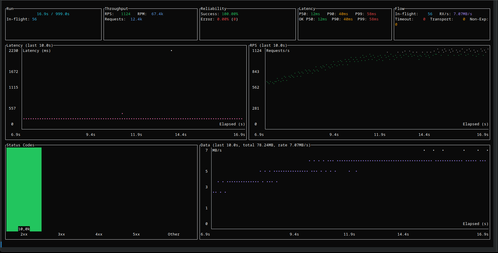

# strest

> [!WARNING]
> Only use strest for testing infrastructure you own or have explicit permission to test. Unauthorized use may be illegal.

strest is a command-line tool for stress testing web servers with real-time stats, deterministic replay, and built-in memory diagnostics.

## Why strest

- Deterministic replay without re-hitting prod.
- Built-in memory growth investigation (RSS logging + heap profiling).
- All-vs-ok latency separation so failures don’t hide tail pain.
- Config-first workflows with no JS runtime tax.
- Controller/agent distributed mode with streaming aggregation.

## Quick Start

```bash
cargo install strest
```

```bash
strest -u http://localhost:3000 -t 30
```

Scenario quickstart:

```toml
# strest.toml
[scenario]
base_url = "http://localhost:3000"

[[scenario.steps]]
method = "get"
path = "/health"
assert_status = 200
```

```bash
strest --config strest.toml -t 30 --no-tui --summary --no-charts
```

## Screenshots

<div style="text-align: center;">
  
</div>

Charts focus on signal:

- All vs ok latency percentiles show tail impact from failures.
- Throughput + inflight reveal saturation and ramp behavior.
- Error breakdown separates timeouts, transport errors, and non-expected status codes.

Full gallery: `docs/guides/USAGE.md#charts`.

## Docs

- `docs/README.md` for documentation index and structure.
- `docs/guides/USAGE.md` for CLI, flags, configs, and charts.
- `docs/guides/ADVANCED.md` for replay, WASM, profiling, distributed mode, and sinks.

## Contributions

If you'd like to contribute, start with `CONTRIBUTING.md` for the workflow and checks.

This project is dual-licensed under MIT OR Apache-2.0.
See `LICENSE-MIT` and `LICENSE-APACHE` for details.
