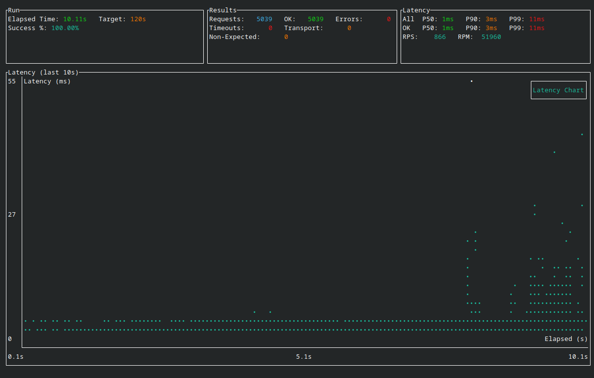
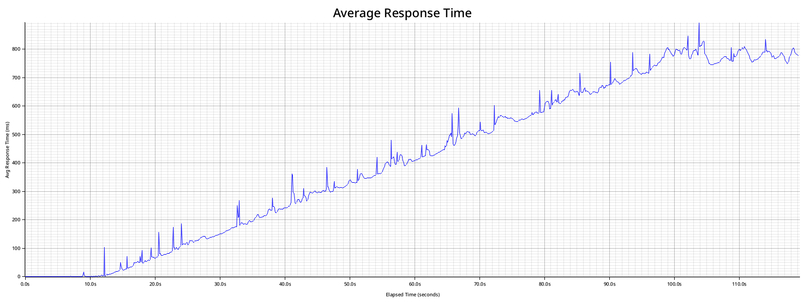
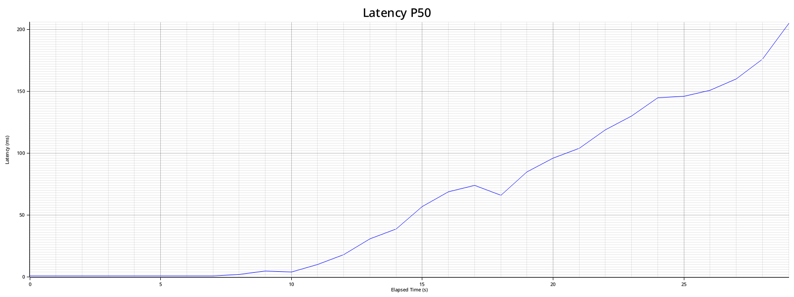
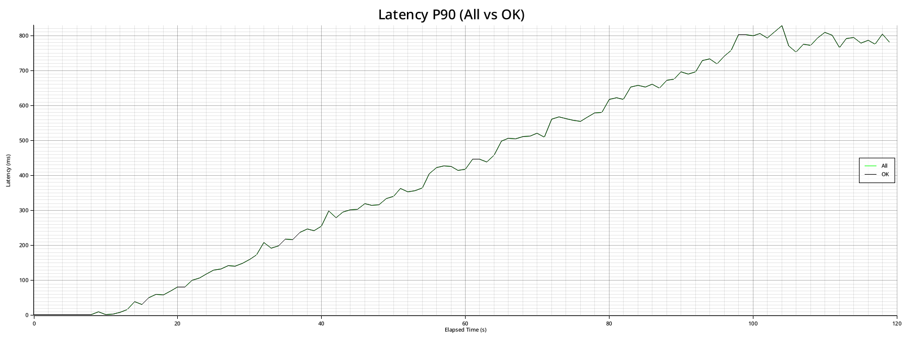
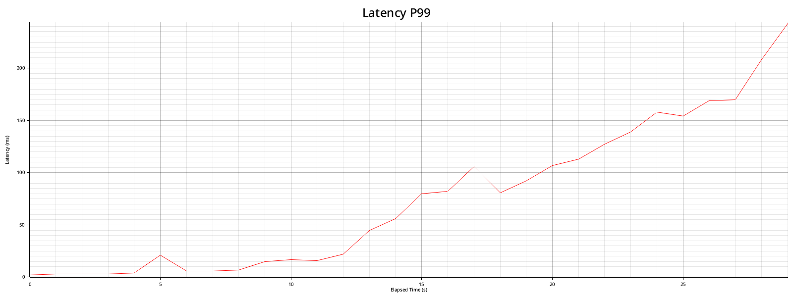
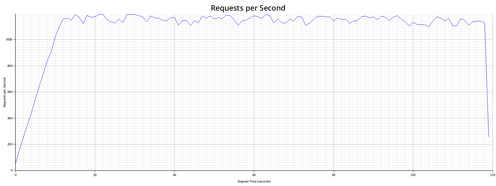
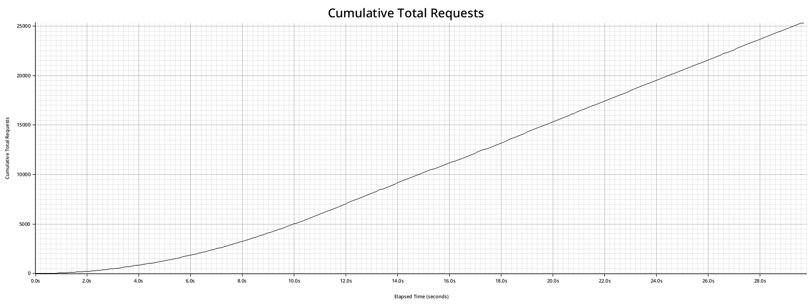
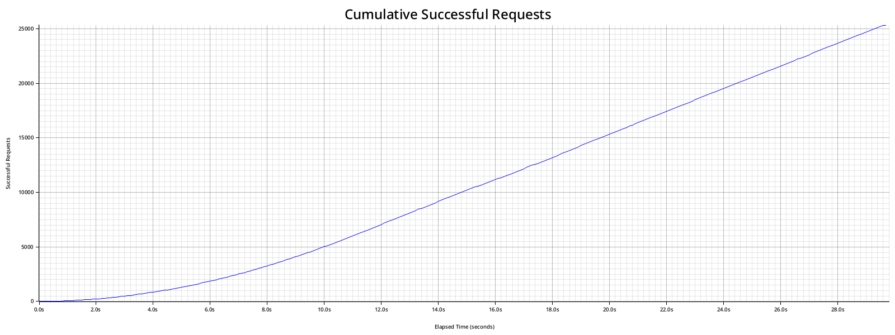
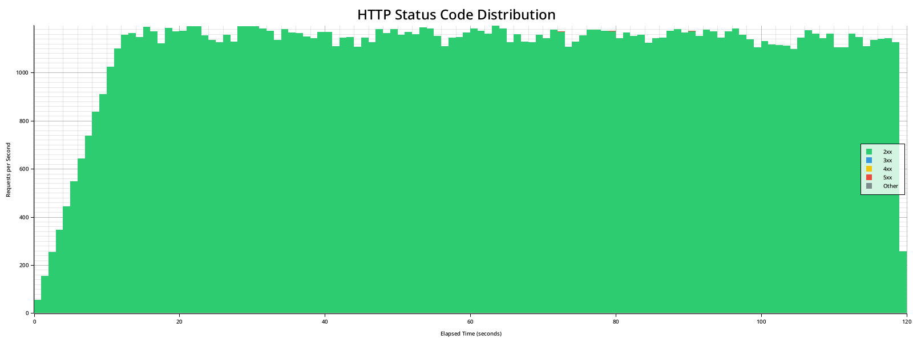

# strest

> [!WARNING]
> Only use strest for testing infrastructure you own or have explicit permission to test. Unauthorized use may be illegal.

strest is a command-line tool for stress testing web servers by sending a large number of HTTP requests. It provides insights into server performance by measuring average response times, reporting observed requests per minute (RPM), and other relevant metrics.

# Screenshot Overview  
These screenshots showcase key metrics and real-time statistics from strest’s stress testing, including response time, error rate, request count, latency percentiles (all vs ok), timeouts, status distribution, and throughput.

<div style="text-align: center;">
  
</div>

### Latency

<table>
  <tr>
    <td align="center">
      <a href="docs/average_response_time.png" target="_blank">
        
      </a>
    </td>
    <td align="center">
      <a href="docs/latency_percentiles_P50.png" target="_blank">
        
      </a>
    </td>
    <td align="center">
      <a href="docs/latency_percentiles_P90.png" target="_blank">
        
      </a>
    </td>
    <td align="center">
      <a href="docs/latency_percentiles_P99.png" target="_blank">
        
      </a>
    </td>
  </tr>
</table>

### Throughput

<table>
  <tr>
    <td align="center">
      <a href="docs/requests_per_second.png" target="_blank">
        
      </a>
    </td>
    <td align="center">
      <a href="docs/cumulative_total_requests.png" target="_blank">
        
      </a>
    </td>
    <td align="center">
      <a href="docs/cumulative_successful_requests.png" target="_blank">
        
      </a>
    </td>
    <td align="center">
      <a href="docs/inflight_requests.png" target="_blank">
        
      </a>
    </td>
  </tr>
</table>

### Errors

<table>
  <tr>
    <td align="center">
      <a href="docs/cumulative_error_rate.png" target="_blank">
        
      </a>
    </td>
    <td align="center">
      <a href="docs/error_rate_breakdown.png" target="_blank">
        
      </a>
    </td>
    <td align="center">
      <a href="docs/timeouts_per_second.png" target="_blank">
        
      </a>
    </td>
    <td align="center">
      <a href="docs/status_code_distribution.png" target="_blank">
        
      </a>
    </td>
  </tr>
</table>

## Features

- Send HTTP requests to a specified URL for a specified duration.
- Customize the HTTP method, headers, and request payload data.
- Measure the average response time of successful requests.
- Report the observed requests per minute (RPM) metric.
- Display real-time statistics and progress in the terminal.
- UI shows timeouts, transport errors, non-expected status, and ok vs all percentiles.
- UI chart window length is configurable via `--ui-window-ms` (default: 10000).
- Optional non-interactive summary output for long-running tests.
- Streams run metrics to disk while aggregating summary and chart data during the run.
- Replay mode with the default TUI chart for post-mortem analysis.
- Snapshotting during replay (interval + range) for focused exports.
- Optional rate limiting for controlled load generation.
- Optional CSV/JSON/JSONL exports for pipeline integration and streaming-friendly parsing.
- Scenario scripts with multi-step flows, dynamic templates, and per-step asserts.
- Experimental WASM scripting to generate scenarios programmatically.
- Warm-up period support to exclude early metrics from summaries and charts.
- TLS/HTTP/2 controls (TLS min/max, HTTP/2 toggle, ALPN selection).
- HDR histogram percentiles for accurate end-of-run latency stats.
- Pluggable output sinks (Prometheus textfile, OTel JSON, Influx line protocol).
- Distributed mode with controller/agent coordination and weighted load splits.
- Distributed streaming summaries for live aggregation and sink updates.
- Manual controller mode with HTTP start/stop control and scenario registry.
- Agent standby mode with automatic reconnects between runs.
- Experimental HTTP/3 support (build flag required).
- Linux systemd install/uninstall helpers for controller/agent services.
- Cleanup command to prune temporary run data.

## Who It's For

- Engineers who want a config-first, CLI-driven load test tool.
- Teams who need multi-step scenarios with assertions, not full JS runtimes.
- CI and lab users who want reproducible runs and exportable metrics.
- Distributed testing setups with controller/agent coordination.

## Not a Fit For

- k6 users looking for JavaScript scripting or k6-compatible workflows.
- GUI-first users who want a hosted dashboard-first experience today.

## Prerequisites

- Make sure you have Rust and Cargo installed on your system. You can install Rust from [rustup.rs](https://rustup.rs/).

## Installation

### From crates.io (recommended)

```bash
cargo install strest
```

### Prebuilt binaries

Prebuilt binaries are attached to GitHub Releases for tagged versions (Linux, macOS, Windows).

### From source

To use strest from source, follow these installation instructions:

1. Clone the repository to your local machine:

    ```bash
    git clone https://github.com/Lythaeon/strest.git
    ```

2. Change to the project directory:

    ```bash
    cd strest
    ```

3. Build the project:

    ```bash
    cargo build --release --locked
    ```

4. Once the build is complete, you can find the executable binary in the `/target/release/` directory.

5. Copy the binary to a directory in your system's PATH to make it globally accessible:

    ```bash
    sudo cp ./target/release/strest /usr/local/bin/
    ```

Alternatively, install from the local path using Cargo:

```bash
cargo install --path . --locked
```

## Getting Started

Quick smoke test:

```bash
strest -u http://localhost:3000 -t 30
```

Scenario quickstart:

```toml
# strest.toml
[scenario]
base_url = "http://localhost:3000"

[[scenario.steps]]
method = "get"
path = "/health"
assert_status = 200
```

```bash
strest --config strest.toml -t 30 --no-tui --summary --no-charts
```

## Usage

strest is used via the command line. Here's a basic example of how to use it:

```bash
strest -u http://localhost:3000 -t 60 --no-charts
```

This command sends GET requests to `http://localhost:3000` for 60 seconds.

For long-running or CI runs, disable the UI and print a summary:

```bash
strest -u http://localhost:3000 -t 600 --no-tui --summary --no-charts
```

For more options and customization, use the --help flag to see the available command-line options and their descriptions.

```bash
strest --help
```

### Logging

Use `--verbose` to enable debug logging (useful for distributed controller/agent handshakes). You can also override the log level via `STREST_LOG` or `RUST_LOG`.

### Presets

Smoke (quick validation, low load):

```bash
strest -u http://localhost:3000 -t 15 --rate 50 --max-tasks 50 --spawn-rate 10 --spawn-interval 100 --no-charts
```

Steady (sustained load, CI-friendly):

```bash
strest -u http://localhost:3000 -t 300 --rate 500 --max-tasks 500 --spawn-rate 20 --spawn-interval 100 --no-tui --summary --no-charts
```

Ramp (gradual increase):

```toml
# ramp.toml
url = "http://localhost:3000"
duration = 300

[load]
rate = 100

[[load.stages]]
duration = "60s"
target = 300

[[load.stages]]
duration = "120s"
target = 800
```

```bash
strest --config ramp.toml --no-tui --summary --no-charts
```

### Charts

By default charts are stored in `~/.strest/charts` (or `%USERPROFILE%\\.strest\\charts` on Windows). You can change the location via `--charts-path` (`-c`).

To disable charts use the `--no-charts` flag.

Charts produced:
- `average_response_time.png`
- `cumulative_successful_requests.png`
- `cumulative_error_rate.png`
- `cumulative_total_requests.png`
- `requests_per_second.png`
- `latency_percentiles_P50.png` (all vs ok overlay)
- `latency_percentiles_P90.png` (all vs ok overlay)
- `latency_percentiles_P99.png` (all vs ok overlay)
- `timeouts_per_second.png`
- `error_rate_breakdown.png` (timeouts vs transport vs non-expected)
- `status_code_distribution.png`
- `inflight_requests.png`

### UI Metrics

The UI highlights:
- Total requests, success count, and error breakdown (timeouts, transport errors, non-expected status).
- All vs ok latency percentiles (P50/P90/P99).
- Live RPS and RPM.

### Temp Data

Run data is logged to a temporary file during the test while summary and chart data are aggregated during the run. This keeps the request pipeline from blocking on metrics in long runs. By default this lives in `~/.strest/tmp` (or `%USERPROFILE%\\.strest\\tmp` on Windows). You can change the location via `--tmp-path`. Temporary data is deleted after the run unless `--keep-tmp` is set.

Charts collection can be bounded for long runs:

- `--metrics-range` limits chart collection to a time window (e.g., `10-30` seconds).
- `--metrics-max` caps the total number of metrics kept for charts (default: `1000000`).

You can also clean up old tmp logs:

```bash
strest cleanup --tmp-path ~/.strest/tmp --older-than 24h --dry-run
strest cleanup --tmp-path ~/.strest/tmp --older-than 24h --force
```

Replay snapshots are written to `~/.strest/snapshots` (or `%USERPROFILE%\\.strest\\snapshots` on Windows) by default. Override the destination with `--replay-snapshot-out`.

### Replay (Post-Mortem)

Replay lets you re-run summaries from tmp logs or exported CSV/JSON/JSONL without hitting the target again.
In TTY mode, replay uses the same TUI as live runs (including the latency chart), and it shows snapshot markers plus the hotkeys.

From tmp logs:

```bash
strest --replay --tmp-path ~/.strest/tmp
```

From exports:

```bash
strest --replay --export-csv ./metrics.csv
strest --replay --export-json ./metrics.json
strest --replay --export-jsonl ./metrics.jsonl
```

JSONL is recommended for large runs and streaming scenarios because it can be parsed incrementally.

Windowing and controls:

```bash
strest --replay --tmp-path ~/.strest/tmp --replay-start 10s --replay-end 2m --replay-step 5s
```

Replay snapshots:

```bash
strest --replay --export-jsonl ./metrics.jsonl --replay-snapshot-interval 30s --replay-snapshot-format jsonl
strest --replay --tmp-path ~/.strest/tmp --replay-snapshot-start 10s --replay-snapshot-end 2m --replay-snapshot-format json
```

Controls: `space` play/pause, `←/→` seek, `r` restart, `q` quit, `s` mark snapshot start, `e` mark snapshot end, `w` write snapshot.
Snapshots default to `~/.strest/snapshots` (or `%USERPROFILE%\\.strest\\snapshots` on Windows) unless `--replay-snapshot-out` is set.

### Common Options

- `--method` (`-X`) sets the HTTP method.
- `--url` (`-u`) sets the target URL.
- `--headers` (`-H`) adds request headers (repeatable, `Key: Value`).
- `--accept` (`-A`) sets the Accept header (shortcut for `-H "Accept: ..."`)
- `--content-type` (`-T`) sets the Content-Type header (shortcut for `-H "Content-Type: ..."`)
- `--no-ua` disables the default `User-Agent: strest-loadtest/<version> (+https://github.com/Lythaeon/strest)` header (requires `--authorized`).
- `--authorized` confirms you have explicit permission to run tests when using `--no-ua`.
- `--data` (`-d`) sets the request body data (POST/PUT/PATCH).
- `--data-file` (`-D`) sets the request body from a file.
- `--data-lines` (`-Z`) sets the request body from a file line by line.
- `--duration` (`-t`) sets the test duration in seconds.
- `--requests` stops after N total requests.
- `--no-tui` disables the interactive UI and shows a progress bar in the terminal (summary output is printed automatically).
- `--ui-window-ms` sets the UI chart window length in milliseconds (default: `10000`).
- `--summary` prints an end-of-run summary.
- `--status` (`-s`) sets the expected HTTP status code.
- `--timeout` sets the request timeout (supports `ms`, `s`, `m`, `h`).
- `--connect-timeout` sets the connection timeout (supports `ms`, `s`, `m`, `h`).
- `--warmup` ignores the first N seconds for summary/charts/exports (supports `ms`, `s`, `m`, `h`).
- `--proxy` (`-p`) sets a proxy URL.
- `--max-tasks` (`-m`) limits concurrent request tasks (`--concurrency`, `--connections` alias).
- `--spawn-rate` (`-r`) and `--spawn-interval` (`-i`) control how quickly tasks are spawned.
- `--rate` sets a global requests-per-second limit.
- `--controller-listen` starts a distributed controller (e.g., `0.0.0.0:9009`).
- `--controller-mode` selects controller mode (`auto` or `manual`).
- `--control-listen` sets the manual control-plane HTTP listen address.
- `--control-auth-token` sets the control-plane Bearer token.
- `--agent-join` joins a distributed controller as an agent.
- `--auth-token` sets a shared token for controller/agent authentication.
- `--agent-weight` sets an agent weight for load distribution.
- `--agent-id` sets an explicit agent id.
- `--min-agents` sets how many agents the controller waits for before starting.
- `--agent-wait-timeout-ms` sets a max wait time for min agents (auto mode; manual start honors this too).
- `--agent-standby` keeps agents connected between distributed runs.
- `--agent-reconnect-ms` sets the standby reconnect interval.
- `--agent-heartbeat-interval-ms` sets the agent heartbeat interval.
- `--agent-heartbeat-timeout-ms` sets the controller heartbeat timeout.
- `--stream-interval-ms` sets the stream snapshot interval for distributed mode.
- `--script` runs a WASM script that produces a scenario (requires `--features wasm` build).
- `--replay` replays a run from tmp logs or exported CSV/JSON/JSONL.
- `--replay-start` and `--replay-end` set the replay window (supports `min`/`max` or durations like `10s`).
- `--replay-step` sets the seek step for replay.
- `--replay-snapshot-interval` writes snapshots every N seconds during replay.
- `--replay-snapshot-start` and `--replay-snapshot-end` set the snapshot window for replay.
- `--replay-snapshot-out` sets where snapshots are written (dir or file).
- `--replay-snapshot-format` sets snapshot format (`json`, `jsonl`, `csv`).
- `--tls-min` and `--tls-max` set the TLS version floor/ceiling.
- `--http2` enables HTTP/2 (adaptive).
- `--http3` enables HTTP/3 (requires `--features http3` and `RUSTFLAGS=--cfg reqwest_unstable`).
- `--alpn` sets the advertised protocols (repeatable, e.g. `--alpn h2`).
- `--tmp-path` sets where temporary run data is written.
- `--keep-tmp` keeps temporary run data after completion.
- `--log-shards` controls the number of log writers (default `1`).
- `--export-csv` writes metrics to a CSV file (bounded by `--metrics-range` and `--metrics-max`).
- `--export-json` writes summary and metrics to a JSON file (bounded by `--metrics-range` and `--metrics-max`).
- `--export-jsonl` writes summary and metrics as newline-delimited JSON (JSONL).
- `--output` (`-o`) writes results to a file (aliases the export formats).
- `--output-format` selects `json`, `jsonl`, or `csv` (or infer from extension for `--output`).
- `--db-url` writes per-request metrics to a sqlite database (table `metrics`).
- `--install-service` installs a Linux systemd service for controller/agent.
- `--uninstall-service` removes a Linux systemd service for controller/agent.
- `--service-name` overrides the systemd service name.

HTTP/3 is experimental and requires building with `--features http3` plus
`RUSTFLAGS="--cfg reqwest_unstable"` (reqwest requirement):

```bash
RUSTFLAGS="--cfg reqwest_unstable" cargo build --release --features http3
```

### Configuration File

You can provide a config file with `--config path`. If no config is specified, `strest` will look for `./strest.toml` or `./strest.json` (TOML is preferred if both exist). CLI flags override config values.
By default, strest sends `User-Agent: strest-loadtest/<version> (+https://github.com/Lythaeon/strest)`. To disable, set `no_ua = true` and `authorized = true`.

Example `strest.toml`:

```toml
url = "http://localhost:3000"
method = "get"
duration = 60
timeout = "10s"
warmup = "5s"
status = 200
no_ui = true
ui_window_ms = 10000
summary = true
no_charts = true

tls_min = "1.2"
tls_max = "1.3"
http2 = true
alpn = ["h2"]

headers = [
  "Content-Type: application/json",
  "X-Env: local",
]

metrics_range = "10-30"
metrics_max = 1000000

[load]
rate = 1000

[[load.stages]]
duration = "10s"
target = 500

[[load.stages]]
duration = "20s"
target = 1500
```

Load profiles are optional. `load.rate` is the initial RPS, and each stage linearly ramps to its `target` RPS over the stage `duration`. You can use `rpm` instead of `rate/target` for RPM-based control.

Example `strest.json`:

```json
{
  "url": "http://localhost:3000",
  "method": "get",
  "duration": 60,
  "warmup": "5s",
  "status": 200,
  "no_ui": true,
  "ui_window_ms": 10000,
  "summary": true,
  "no_charts": true,
  "tls_min": "1.2",
  "tls_max": "1.3",
  "http2": true,
  "alpn": ["h2"],
  "headers": [
    "Content-Type: application/json",
    "X-Env: local"
  ],
  "metrics_range": "10-30",
  "metrics_max": 1000000,
  "load": {
    "rate": 1000,
    "stages": [
      { "duration": "10s", "target": 500 },
      { "duration": "20s", "target": 1500 }
    ]
  }
}
```

### Scenario Scripts

Scenario scripts model multi-step flows with per-step asserts and templated payloads. If `scenario.base_url` is set you can omit the top-level `url`. Templates use `{{var}}` placeholders from `scenario.vars`, `step.vars`, and built-ins: `seq`, `step`, `timestamp_ms`, `timestamp_s`.
`think_time` adds a delay after a step completes before the next step starts (supports `ms`, `s`, `m`, `h`).

Example `strest.toml`:

```toml
[scenario]
base_url = "http://localhost:3000"
vars = { user = "demo" }

[[scenario.steps]]
name = "login"
method = "post"
path = "/login"
headers = ["Content-Type: application/json"]
data = "{\"user\":\"{{user}}\",\"seq\":\"{{seq}}\"}"
assert_status = 200
assert_body_contains = "token"
think_time = "500ms"

[[scenario.steps]]
name = "profile"
method = "get"
path = "/profile"
headers = ["Authorization: Bearer {{seq}}"]
```

Example `strest.json`:

```json
{
  "scenario": {
    "base_url": "http://localhost:3000",
    "vars": { "user": "demo" },
    "steps": [
      {
        "name": "login",
        "method": "post",
        "path": "/login",
        "headers": ["Content-Type: application/json"],
        "data": "{\"user\":\"{{user}}\",\"seq\":\"{{seq}}\"}",
        "assert_status": 200,
        "assert_body_contains": "token",
        "think_time": "500ms"
      },
      {
        "name": "profile",
        "method": "get",
        "path": "/profile",
        "headers": ["Authorization: Bearer {{seq}}"]
      }
    ]
  }
}
```

### WASM Scripts (Experimental)

You can generate scenarios from a WASM module and run them with `--script`. This is useful when you want programmable test setup while still using strest’s scenario engine.

Build with the optional feature:

```bash
cargo build --release --features wasm
```

Run with a WASM script:

```bash
strest --script ./script.wasm --no-tui --summary --no-charts
```

Example WASM script (prebuilt in this repo):

```bash
# Optional: regenerate from WAT
wasm-tools parse examples/wasm/interesting.wat -o examples/wasm/interesting.wasm

# Run the example scenario
cargo run --features wasm -- --script examples/wasm/interesting.wasm -t 20 --no-tui --summary --no-charts
```

Note: the example scenario targets `http://localhost:8887` and expects `/health`, `/login`,
`/search`, `/items/{id}`, and `/checkout` endpoints to exist. Update the WAT if your server differs.

**WASM contract**

Your module must export:

- `memory`
- `scenario_ptr() -> i32` (pointer to a UTF-8 JSON buffer)
- `scenario_len() -> i32` (length of that buffer in bytes)

The JSON payload must match the `scenario` config schema (same as `strest.toml` / `strest.json`). It **must** include `schema_version: 1`. Size is capped at 1MB.

Sandboxing policy (enforced):

- No imports are allowed.
- The exported `memory` must declare a maximum and be <= 128 pages.
- The module size is capped at 4MB.
- The scenario payload is capped at 1MB.
- `scenario_ptr` and `scenario_len` must return constant `i32` values.
- `memory64` and shared memory are not allowed.

Minimal Rust example (`wasm32-unknown-unknown`):

```rust
#[no_mangle]
pub extern "C" fn scenario_ptr() -> i32 {
    SCENARIO.as_ptr() as i32
}

#[no_mangle]
pub extern "C" fn scenario_len() -> i32 {
    SCENARIO.len() as i32
}

static SCENARIO: &str = r#"{
  "schema_version": 1,
  "base_url": "http://localhost:3000",
  "steps": [
    { "method": "get", "path": "/health", "assert_status": 200 }
  ]
}"#;
```

Notes:

- If you pass `--url`, it becomes the default base URL when the scenario omits `base_url`.
- `--script` cannot be combined with an explicit `scenario` config section.

### Output Sinks

Configure output sinks in the config file to emit summary metrics periodically during the run
and once after the run completes. The default update interval is 1000ms.

Example `strest.toml`:

```toml
[sinks]
# Optional. Controls periodic updates (defaults to 1000ms).
update_interval_ms = 1000

[sinks.prometheus]
path = "./out/strest.prom"

[sinks.otel]
path = "./out/strest.otel.json"

[sinks.influx]
path = "./out/strest.influx"
```

### Distributed Mode

Run a controller and one or more agents. If you configure sinks on agents, they write per-agent
files when stream summaries are off. If you configure sinks on the controller, it writes an
aggregated sink report at the end of the run (or periodically when streaming).
If `distributed.stream_summaries = true`, agents stream
periodic summaries to the controller; the controller updates sinks during the run and agents
skip local sink writes. Stream cadence is controlled by `distributed.stream_interval_ms`
(default 1000ms) and sink update cadence by `sinks.update_interval_ms`. When UI rendering is
enabled, the controller aggregates streamed metrics into the UI.
Use `distributed.agent_wait_timeout_ms` (or `--agent-wait-timeout-ms`) to bound how long the
controller waits for `min_agents` before starting.
The controller does not generate load; it only orchestrates and aggregates. Agents are the
ones that send requests.
Agents send periodic heartbeats; the controller marks agents unhealthy if no heartbeat is
seen within `--agent-heartbeat-timeout-ms` (default 3000ms).
Aggregated charts are available in distributed mode when `--stream-summaries` is enabled and
`--no-charts` is not set (charts are written by the controller). Per-agent exports are still
disabled during distributed runs.
CLI equivalents: `--stream-summaries` and `--stream-interval-ms 1000`.

When using `--script` in distributed mode, only the controller needs the WASM-enabled build.
The controller loads the script, generates the scenario, and coordinates the agents with the
resulting scenario; agents do not execute WASM.

### Kubernetes (Basic Manifests)

The `kubernetes/` folder ships minimal manifests for a controller and scalable agents.

Apply:

```bash
kubectl apply -f kubernetes/
```

Scale agents:

```bash
kubectl scale deployment strest-agent --replicas=100
```

Start a run (manual controller mode; port-forward the control plane):

```bash
kubectl port-forward service/strest-controller 9010:9010
curl -X POST http://127.0.0.1:9010/start -d '{"start_after_ms":2000}'
```

Agents discover the controller via the service DNS name
`strest-controller.<namespace>.svc.cluster.local` (the manifests use
`strest-controller:9009`).

Scaling notes:
- There is no hard agent limit; practical limits come from OS file descriptors, CPU, and memory.
- Streaming summaries add controller load (histogram decode + merge). Increase `--stream-interval-ms`
  to reduce overhead as agent counts grow.
- Wire messages are capped at 4MB; very large histograms can exceed this limit.

Controller:

```bash
strest --controller-listen 0.0.0.0:9009 --min-agents 2 --auth-token secret
```

Agent:

```bash
strest --agent-join 10.0.0.5:9009 --auth-token secret --agent-weight 2
```

Agent standby (keeps the agent connected and auto-reconnects between runs):

```bash
strest --agent-join 10.0.0.5:9009 --auth-token secret --agent-standby --agent-reconnect-ms 1000
```

Example `strest.toml` controller config:

```toml
[distributed]
role = "controller"
listen = "0.0.0.0:9009"
auth_token = "secret"
min_agents = 2
agent_wait_timeout_ms = 30000
agent_heartbeat_timeout_ms = 3000
stream_summaries = true
stream_interval_ms = 1000
```

Example `strest.toml` agent config:

```toml
[distributed]
role = "agent"
join = "10.0.0.5:9009"
auth_token = "secret"
agent_id = "agent-1"
weight = 2
agent_heartbeat_interval_ms = 1000
```

Manual controller mode (HTTP control plane):

```bash
strest --controller-listen 0.0.0.0:9009 --controller-mode manual --control-listen 127.0.0.1:9010 --auth-token secret --control-auth-token control-secret
```

Manual controller config example:

```toml
[distributed]
role = "controller"
controller_mode = "manual"
listen = "0.0.0.0:9009"
control_listen = "127.0.0.1:9010"
control_auth_token = "control-secret"
```

Start and stop via HTTP:

```bash
curl -X POST http://127.0.0.1:9010/start -H "Authorization: Bearer control-secret"
curl -X POST http://127.0.0.1:9010/start -H "Authorization: Bearer control-secret" -d '{"scenario_name":"login"}'
curl -X POST http://127.0.0.1:9010/stop -H "Authorization: Bearer control-secret"
```

The `/start` payload can include `scenario_name` (from the registry) and/or an inline
`scenario` (same schema as the config file). If you pass a `scenario` without a name,
it runs once and is not stored. If you pass both `scenario` and `scenario_name`,
the controller stores/updates that named scenario and runs it. You can also pass
`start_after_ms` to delay the run and `agent_wait_timeout_ms` to wait for enough
agents before starting. If omitted, the controller runs the default scenario or
`--url` configured on startup.

Scenario registry (preload multiple named scenarios):

```toml
[scenario]
base_url = "http://localhost:3000"

[[scenario.steps]]
method = "get"
path = "/health"
assert_status = 200

[scenarios.login]
base_url = "http://localhost:3000"

[[scenarios.login.steps]]
method = "post"
path = "/login"
data = "{\"user\":\"demo\"}"
assert_status = 200
```

### Linux Systemd Service

Install a controller service (requires sudo):

```bash
sudo strest --controller-listen 0.0.0.0:9009 --controller-mode manual --control-listen 127.0.0.1:9010 --install-service --service-name strest-controller
```

Install an agent service:

```bash
sudo strest --agent-join 10.0.0.5:9009 --agent-standby --install-service --service-name strest-agent
```

Uninstall a service:

```bash
sudo strest --controller-listen 0.0.0.0:9009 --uninstall-service --service-name strest-controller
```

Systemd install/uninstall writes to `/etc/systemd/system` and runs `systemctl`, so it must be executed with sudo.

### Reproducible Builds

Use `--locked` to ensure the build uses the exact dependency versions in `Cargo.lock`:

```bash
cargo build --release --locked
```

### Testing

Run the full test suite with nextest:

```bash
cargo make test
```

Run the WASM end-to-end test:

```bash
cargo make test-wasm
```

### Formatting

Check formatting with:

```bash
cargo make format-check
```

Auto-format with:

```bash
cargo make format
```

## Contributions

If you'd like to contribute, please start with `CONTRIBUTING.md` for the exact workflow and checks.

I'm a solo maintainer, so response times may vary. I review contributions as time allows and will respond when I can.


This project is licensed under the GNU AGPL v3.0 - see the [LICENSE](LICENSE) file for details.

## Motivation 

strest was born to provide performance insight for stexs and the infrastructure behind it.
