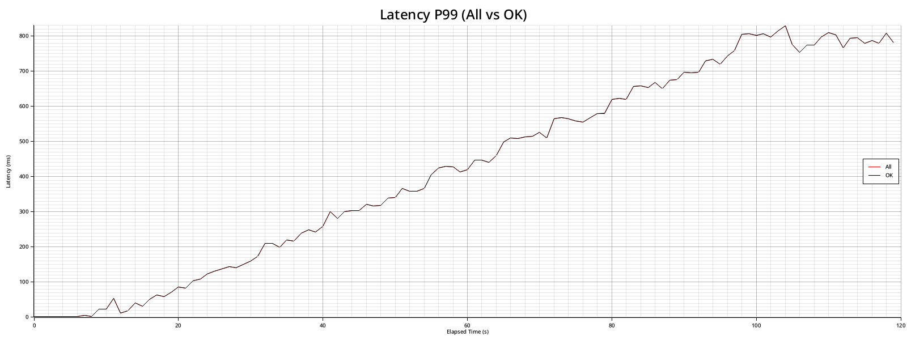

# Usage

This page covers CLI usage, flags, configs, and chart outputs.

## Prerequisites

- Rust and Cargo (install via rustup).

## Installation

From crates.io (recommended):

```bash
cargo install strest
```

Prebuilt binaries are attached to GitHub Releases for tagged versions (Linux, macOS, Windows).

From source:

```bash
git clone https://github.com/Lythaeon/strest.git
cd strest
cargo build --release --locked
```

The binary will be in `./target/release/strest`. You can also install from the local path:

```bash
cargo install --path . --locked
```

## Getting Started

Quick smoke test:

```bash
strest -u http://localhost:3000 -t 30
```

Scenario quickstart:

```toml
# strest.toml
[scenario]
base_url = "http://localhost:3000"

[[scenario.steps]]
method = "get"
path = "/health"
assert_status = 200
```

```bash
strest --config strest.toml -t 30 --no-tui --summary --no-charts
```

## 99% Paths

Use these first. They are the intended onboarding paths.

Local quick check:

```bash
strest quick --url http://localhost:3000
```

Long soak run:

```bash
strest soak --url http://localhost:3000
```

Burst/spike test:

```bash
strest spike --url http://localhost:3000
```

Distributed controller run (wait for agents):

```bash
strest distributed --url http://localhost:3000 --agents 3
```

Replay from exported metrics:

```bash
strest --replay --export-jsonl ./metrics.jsonl
```

## Usage

Basic example:

```bash
strest -u http://localhost:3000 -t 60 --no-charts
```

For long-running or CI runs:

```bash
strest -u http://localhost:3000 -t 600 --no-tui --summary --no-charts
```

For full CLI options:

```bash
strest --help
```

`--help` is intentionally split into `Common Options` (day-to-day flags) and `Advanced Options` (full sharp-edged surface).

## Logging

Use `--verbose` to enable debug logging (useful for distributed controller/agent handshakes). You can also override the log level via `STREST_LOG` or `RUST_LOG`.

## Preset Subcommands

Quick baseline:

```bash
strest quick --url http://localhost:3000
```

Soak (long run, no TUI + summary by default):

```bash
strest soak --url http://localhost:3000
```

Spike (short, aggressive ramp profile):

```bash
strest spike --url http://localhost:3000
```

Distributed controller preset (wait for agents):

```bash
strest distributed --url http://localhost:3000 --agents 3
```

You can still use the full advanced CLI surface (`strest --help`) for fine-grained control. Presets are additive and do not remove existing flags.

## Protocols and Load Modes

`strest` now exposes explicit intent flags:

```bash
strest --protocol http --load-mode arrival -u http://localhost:3000
```

Common `--load-mode` values map to existing workflows:

- `arrival`: steady arrival-rate style runs (`--rate` or unrestricted open-loop).
- `step`: stepwise load profile stages (`[load]` config stages).
- `ramp`: linear ramps between load profile stages.
- `burst`: short spike/burst behavior (`--burst-delay` + `--burst-rate` or `strest spike`).
- `soak`: long-running stability profile (`strest soak`).
- `jitter`: reserved intent for randomized inter-arrival modeling.

Protocol adapter values are versioned in the CLI for discoverability.
Current executable adapters: `http`, `grpc-unary`, `grpc-streaming`, `websocket`,
`tcp`, `udp`, `quic`, `mqtt`, `enet`, `kcp`, `raknet`.
`grpc-unary` currently accepts `arrival` and `ramp` load modes; other executable adapters accept
all current load modes.
Protocol compatibility is validated through a central adapter registry.
This registry is currently compile-time (built into the binary), not runtime external plugin loading.

WASM extensions are split by role:

- `--script`: scenario-generation input for strest's scenario engine
- `--plugin`: lifecycle hook integrations via WASI command ABI

## Charts

Charts are stored in `~/.strest/charts` (or `%USERPROFILE%\\.strest\\charts` on Windows) under per-run folders:
`run-<YYYY-MM-DD_HH-MM-SS>_<HOST-PORT>`. Change root location via `--charts-path` (`-c`).

To disable charts use `--no-charts`.
Latency percentile charts are bucketed at 100ms by default; adjust with `--charts-latency-bucket-ms`.

Charts produced:

- `average_response_time.png`
- `cumulative_successful_requests.png`
- `cumulative_error_rate.png`
- `cumulative_total_requests.png`
- `requests_per_second.png`
- `latency_percentiles_P50_all.png` (all requests)
- `latency_percentiles_P50_ok.png` (ok requests only)
- `latency_percentiles_P90_all.png` (all requests)
- `latency_percentiles_P90_ok.png` (ok requests only)
- `latency_percentiles_P99_all.png` (all requests)
- `latency_percentiles_P99_ok.png` (ok requests only)
- `timeouts_per_second.png`
- `error_rate_breakdown.png` (timeouts vs transport vs non-expected)
- `status_code_distribution.png`
- `inflight_requests.png`

## Screenshot Gallery

### Latency

All vs ok latency percentiles let you see tail impact from failures instead of hiding them.

<table>
  <tr>
    <td align="center">
      <a href="average_response_time.png" target="_blank">
        
      </a>
    </td>
    <td align="center">
      <a href="latency_percentiles_P50_all.png" target="_blank">
        
      </a>
    </td>
    <td align="center">
      <a href="latency_percentiles_P90_all.png" target="_blank">
        
      </a>
    </td>
    <td align="center">
      <a href="latency_percentiles_P99_all.png" target="_blank">
        
      </a>
    </td>
  </tr>
</table>

### Throughput

Throughput and inflight charts reveal saturation points and load ramp behavior.

<table>
  <tr>
    <td align="center">
      <a href="requests_per_second.png" target="_blank">
        
      </a>
    </td>
    <td align="center">
      <a href="cumulative_total_requests.png" target="_blank">
        
      </a>
    </td>
    <td align="center">
      <a href="cumulative_successful_requests.png" target="_blank">
        
      </a>
    </td>
    <td align="center">
      <a href="inflight_requests.png" target="_blank">
        
      </a>
    </td>
  </tr>
</table>

### Errors

Error breakdown separates timeouts, transport errors, and non-expected status codes.

<table>
  <tr>
    <td align="center">
      <a href="cumulative_error_rate.png" target="_blank">
        
      </a>
    </td>
    <td align="center">
      <a href="error_rate_breakdown.png" target="_blank">
        
      </a>
    </td>
    <td align="center">
      <a href="timeouts_per_second.png" target="_blank">
        
      </a>
    </td>
    <td align="center">
      <a href="status_code_distribution.png" target="_blank">
        
      </a>
    </td>
  </tr>
</table>

## UI Metrics

The UI highlights:

- Total requests, success count, and error breakdown (timeouts, transport errors, non-expected status).
- All vs ok latency percentiles (P50/P90/P99) in separate charts.
- Live RPS and RPM.

## Temp Data

Run data is logged to a temporary file during the test while summary and chart data are aggregated during the run. This keeps the request pipeline from blocking on metrics in long runs. By default this lives in `~/.strest/tmp` (or `%USERPROFILE%\\.strest\\tmp` on Windows). You can change the location via `--tmp-path`. Temporary data is deleted after the run unless `--keep-tmp` is set.

Charts collection can be bounded for long runs:

- `--metrics-range` limits chart collection to a time window (e.g., `10-30` seconds).
- `--metrics-max` caps the total number of metrics kept for charts (default: `1000000`).

Cleanup old tmp logs:

```bash
strest cleanup --tmp-path ~/.strest/tmp --older-than 24h --dry-run
strest cleanup --tmp-path ~/.strest/tmp --older-than 24h --force
strest cleanup --tmp-path ~/.strest/tmp --charts-path ~/.strest/charts --with-charts --older-than 24h --force
```

Replay snapshots are written to `~/.strest/snapshots` (or `%USERPROFILE%\\.strest\\snapshots` on Windows) by default. Override the destination with `--replay-snapshot-out`.

## CLI Quick Reference

Everyday flags:

- `--url` (`-u`) sets the target URL.
- `--duration` (`-t`) sets the test duration in seconds.
- `--rate` (`-q`) sets a global requests-per-second limit.
- `--max-tasks` (`-m`) limits concurrent request tasks (`--concurrency`, `--connections` alias).
- `--no-tui` disables the interactive UI and shows a progress bar in the terminal (summary output is printed automatically).
- `--summary` prints an end-of-run summary.
- `--show-selections` includes the full selection summary at the end of the run (works with TUI).
- `--output` (`-o`) writes results to a file (aliases the export formats).

CLI-only flags (not represented in config):

- `--config` selects the config file (TOML/JSON).
- `--verbose` enables debug logging (unless overridden by `STREST_LOG`/`RUST_LOG`).
- `--charts-path` sets the chart output directory.
- `--charts-latency-bucket-ms` controls the latency percentile bucket size.
- `--show-selections` prints the full selection summary at the end of the run (works with TUI).
- `--replay` replays a run from tmp logs or exported CSV/JSON/JSONL.
- `--replay-start` and `--replay-end` set the replay window (supports `min`/`max` or durations like `10s`).
- `--replay-step` sets the seek step for replay.
- `--replay-snapshot-interval` writes snapshots every N seconds during replay.
- `--replay-snapshot-start` and `--replay-snapshot-end` set the snapshot window for replay.
- `--replay-snapshot-out` sets where snapshots are written (dir or file).
- `--replay-snapshot-format` sets snapshot format (`json`, `jsonl`, `csv`).
- `--controller-listen` starts a distributed controller (e.g., `0.0.0.0:9009`).
- `--controller-mode` selects controller mode (`auto` or `manual`).
- `--control-listen` sets the manual control-plane HTTP listen address.
- `--control-auth-token` sets the control-plane Bearer token.
- `--agent-join` joins a distributed controller as an agent.
- `--auth-token` sets a shared token for controller/agent authentication.
- `--agent-weight` sets an agent weight for load distribution.
- `--agent-id` sets an explicit agent id.
- `--min-agents` sets how many agents the controller waits for before starting.
- `--agent-wait-timeout-ms` sets a max wait time for min agents (auto mode; manual start honors this too).
- `--agent-standby` keeps agents connected between distributed runs.
- `--agent-reconnect-ms` sets the standby reconnect interval.
- `--agent-heartbeat-interval-ms` sets the agent heartbeat interval.
- `--agent-heartbeat-timeout-ms` sets the controller heartbeat timeout.
- `--stream-interval-ms` sets the stream snapshot interval for distributed mode.
- `--stream-summaries` enables streaming summaries in distributed mode.
- `--install-service` installs a Linux systemd service for controller/agent.
- `--uninstall-service` removes a Linux systemd service for controller/agent.
- `--service-name` overrides the systemd service name.

For full CLI options, run `strest --help`.

HTTP/3 is experimental and requires building with `--features http3` plus
`RUSTFLAGS="--cfg reqwest_unstable"` (reqwest requirement):

```bash
RUSTFLAGS="--cfg reqwest_unstable" cargo build --release --features http3
```

## Configuration File

You can provide a config file with `--config path`. If no config is specified, `strest` will look for `./strest.toml` or `./strest.json` (TOML is preferred if both exist). CLI flags override config values.
By default, strest sends `User-Agent: strest-loadtest/<version> (+https://github.com/Lythaeon/strest)`. To disable, set `no_ua = true` and `authorized = true`.

Config keys (top-level):

| Key | Type | CLI / Notes |
| --- | --- | --- |
| `method` | string | `--method` (`-X`) |
| `url` | string | `--url` (`-u`) |
| `urls_from_file` | bool | `--urls-from-file` (requires `url`) |
| `rand_regex_url` | bool | `--rand-regex-url` (requires `url`) |
| `max_repeat` | integer | `--max-repeat` |
| `dump_urls` | integer | `--dump-urls` (requires `rand_regex_url`) |
| `headers` | array[string] | `--headers` (`-H`) |
| `accept` | string | `--accept` (`-A`) |
| `content_type` | string | `--content-type` (`-T`) |
| `data` | string | `--data` (`-d`) |
| `form` | array[string] | `--form` (`-F`) |
| `data_file` | string | `--data-file` (`-D`) |
| `data_lines` | string | `--data-lines` (`-Z`) |
| `basic_auth` | string | `--basic-auth` (`-a`) |
| `aws_session` | string | `--aws-session` |
| `aws_sigv4` | string | `--aws-sigv4` |
| `duration` | integer | `--duration` (`-t`) |
| `wait_ongoing_requests_after_deadline` | bool | `--wait-ongoing-requests-after-deadline` |
| `requests` | integer | `--requests` (`-n`) |
| `timeout` | duration | `--timeout` |
| `connect_timeout` | duration | `--connect-timeout` |
| `warmup` | duration | `--warmup` |
| `status` | integer | `--status` (`-s`) |
| `redirect` | integer | `--redirect` |
| `disable_keepalive` | bool | `--disable-keepalive` |
| `disable_compression` | bool | `--disable-compression` |
| `pool_max_idle_per_host` | integer | `--pool-max-idle-per-host` |
| `pool_idle_timeout_ms` | integer | `--pool-idle-timeout-ms` |
| `charts_path` | string | `--charts-path` (`-c`) |
| `no_charts` | bool | `--no-charts` |
| `charts_latency_bucket_ms` | integer | `--charts-latency-bucket-ms` |
| `no_ua` | bool | `--no-ua` (requires `authorized = true`) |
| `authorized` | bool | `--authorized` |
| `tmp_path` | string | `--tmp-path` |
| `keep_tmp` | bool | `--keep-tmp` |
| `output` | string | `--output` (`-o`) |
| `output_format` | string | `--output-format` |
| `time_unit` | string | `--time-unit` |
| `export_csv` | string | `--export-csv` |
| `export_json` | string | `--export-json` |
| `export_jsonl` | string | `--export-jsonl` |
| `db_url` | string | `--db-url` |
| `log_shards` | integer | `--log-shards` |
| `no_ui` | bool | `--no-tui` / `--no-ui` |
| `ui_window_ms` | integer | `--ui-window-ms` |
| `summary` | bool | `--summary` |
| `tls_min` | string | `--tls-min` |
| `tls_max` | string | `--tls-max` |
| `cacert` | string | `--cacert` |
| `cert` | string | `--cert` |
| `key` | string | `--key` |
| `insecure` | bool | `--insecure` |
| `http2` | bool | `--http2` |
| `http2_parallel` | integer | `--http2-parallel` |
| `http3` | bool | `--http3` |
| `http_version` | string | `--http-version` |
| `alpn` | array[string] | `--alpn` (repeatable) |
| `proxy_url` | string | `--proxy` (`-p`), `proxy` is accepted as an alias in config |
| `proxy_headers` | array[string] | `--proxy-header` (repeatable) |
| `proxy_http_version` | string | `--proxy-http-version` |
| `proxy_http2` | bool | `--proxy-http2` |
| `max_tasks` | integer | `--max-tasks` (`--concurrency`/`--connections` aliases) |
| `spawn_rate` | integer | `--spawn-rate` |
| `spawn_interval` | integer | `--spawn-interval` |
| `rate` | integer | `--rate` (`-q`) |
| `rpm` | integer | `--rpm` |
| `burst_delay` | duration | `--burst-delay` |
| `burst_rate` | integer | `--burst-rate` |
| `latency_correction` | bool | `--latency-correction` |
| `connect_to` | array[string] | `--connect-to` (repeatable) |
| `host` | string | `--host` |
| `ipv6` | bool | `--ipv6` |
| `ipv4` | bool | `--ipv4` |
| `no_pre_lookup` | bool | `--no-pre-lookup` |
| `no_color` | bool | `--no-color` |
| `fps` | integer | `--fps` |
| `stats_success_breakdown` | bool | `--stats-success-breakdown` |
| `unix_socket` | string | `--unix-socket` |
| `load` | object | See load profile keys below |
| `metrics_range` | string | `--metrics-range` |
| `metrics_max` | integer | `--metrics-max` |
| `rss_log_ms` | integer | `--rss-log-ms` |
| `alloc_profiler_ms` | integer | `--alloc-profiler-ms` |
| `alloc_profiler_dump_ms` | integer | `--alloc-profiler-dump-ms` |
| `alloc_profiler_dump_path` | string | `--alloc-profiler-dump-path` |
| `scenario` | object | See scenario keys below |
| `scenarios` | object | Map of name -> scenario config |
| `script` | string | `--script` (WASM scenario generator) |
| `plugin` | array[string] | `--plugin` (repeatable WASM lifecycle plugins; `plugin_wasm` alias supported) |
| `sinks` | object | See sinks keys below |
| `distributed` | object | See distributed keys below |

Load profile keys:

| Key | Type | Notes |
| --- | --- | --- |
| `load.rate` | integer | Initial RPS |
| `load.rpm` | integer | Initial RPM |
| `load.stages[].duration` | string | Duration per stage (e.g., `10s`) |
| `load.stages[].target` | integer | Target RPS for stage |
| `load.stages[].rate` | integer | Stage RPS (mutually exclusive with `target`/`rpm`) |
| `load.stages[].rpm` | integer | Stage RPM (mutually exclusive with `target`/`rate`) |

Scenario keys:

| Key | Type | Notes |
| --- | --- | --- |
| `scenario.schema_version` | integer | Must be `1` for WASM scenarios |
| `scenario.base_url` | string | Default URL when `url` is unset |
| `scenario.method` | string | Default method for steps |
| `scenario.headers` | array[string] | Default headers for steps |
| `scenario.data` | string | Default body for steps |
| `scenario.vars` | object | Global template vars |
| `scenario.steps[]` | object | See step keys below |
| `scenarios` | object | Map of name -> scenario config |

Scenario step keys:

| Key | Type | Notes |
| --- | --- | --- |
| `scenario.steps[].name` | string | Optional label |
| `scenario.steps[].method` | string | Per-step method |
| `scenario.steps[].url` | string | Full URL (overrides base + path) |
| `scenario.steps[].path` | string | Path appended to base URL |
| `scenario.steps[].headers` | array[string] | Per-step headers |
| `scenario.steps[].data` | string | Per-step body |
| `scenario.steps[].assert_status` | integer | Expected HTTP status |
| `scenario.steps[].assert_body_contains` | string | Substring assertion |
| `scenario.steps[].think_time` | duration | Delay after step |
| `scenario.steps[].vars` | object | Per-step template vars |

Sinks keys:

| Key | Type | Notes |
| --- | --- | --- |
| `sinks.update_interval_ms` | integer | Default `1000` |
| `sinks.prometheus.path` | string | Textfile output path |
| `sinks.otel.path` | string | OTel JSON output path |
| `sinks.influx.path` | string | Influx line protocol output path |

Distributed keys:

| Key | Type | Notes |
| --- | --- | --- |
| `distributed.role` | string | `controller` or `agent` |
| `distributed.controller_mode` | string | `auto` or `manual` |
| `distributed.listen` | string | Controller listen address |
| `distributed.control_listen` | string | Manual control-plane listen |
| `distributed.control_auth_token` | string | Control-plane bearer token |
| `distributed.join` | string | Controller address to join |
| `distributed.auth_token` | string | Shared controller/agent token |
| `distributed.agent_id` | string | Explicit agent id |
| `distributed.weight` | integer | Agent weight |
| `distributed.min_agents` | integer | Minimum agents to start |
| `distributed.agent_wait_timeout_ms` | integer | Max wait for min agents |
| `distributed.agent_standby` | bool | Keep agent connected |
| `distributed.agent_reconnect_ms` | integer | Standby reconnect interval |
| `distributed.agent_heartbeat_interval_ms` | integer | Agent heartbeat interval |
| `distributed.agent_heartbeat_timeout_ms` | integer | Controller heartbeat timeout |
| `distributed.stream_summaries` | bool | Stream summaries to controller |
| `distributed.stream_interval_ms` | integer | Stream cadence |

Example `strest.toml`:

```toml
url = "http://localhost:3000"
method = "get"
duration = 60
timeout = "10s"
warmup = "5s"
status = 200
no_ui = true
ui_window_ms = 10000
summary = true
no_charts = true

tls_min = "1.2"
tls_max = "1.3"
http2 = true
alpn = ["h2"]

headers = [
  "Content-Type: application/json",
  "X-Env: local",
]

metrics_range = "10-30"
metrics_max = 1000000

[load]
rate = 1000

[[load.stages]]
duration = "10s"
target = 500

[[load.stages]]
duration = "20s"
target = 1500
```

Load profiles are optional. `load.rate` is the initial RPS, and each stage linearly ramps to its `target` RPS over the stage `duration`. You can use `rpm` instead of `rate/target` for RPM-based control.

Example `strest.json`:

```json
{
  "url": "http://localhost:3000",
  "method": "get",
  "duration": 60,
  "warmup": "5s",
  "status": 200,
  "no_ui": true,
  "ui_window_ms": 10000,
  "summary": true,
  "no_charts": true,
  "tls_min": "1.2",
  "tls_max": "1.3",
  "http2": true,
  "alpn": ["h2"],
  "headers": [
    "Content-Type: application/json",
    "X-Env: local"
  ],
  "metrics_range": "10-30",
  "metrics_max": 1000000,
  "load": {
    "rate": 1000,
    "stages": [
      { "duration": "10s", "target": 500 },
      { "duration": "20s", "target": 1500 }
    ]
  }
}
```

### Scenario Scripts

Scenario scripts model multi-step flows with per-step asserts and templated payloads. If `scenario.base_url` is set you can omit the top-level `url`. Templates use `{{var}}` placeholders from `scenario.vars`, `step.vars`, and built-ins: `seq`, `step`, `timestamp_ms`, `timestamp_s`.
`think_time` adds a delay after a step completes before the next step starts (supports `ms`, `s`, `m`, `h`).

Example `strest.toml`:

```toml
[scenario]
base_url = "http://localhost:3000"
vars = { user = "demo" }

[[scenario.steps]]
name = "login"
method = "post"
path = "/login"
headers = ["Content-Type: application/json"]
data = "{\"user\":\"{{user}}\",\"seq\":\"{{seq}}\"}"
assert_status = 200
assert_body_contains = "token"
think_time = "500ms"

[[scenario.steps]]
name = "profile"
method = "get"
path = "/profile"
headers = ["Authorization: Bearer {{seq}}"]
```

Example `strest.json`:

```json
{
  "scenario": {
    "base_url": "http://localhost:3000",
    "vars": { "user": "demo" },
    "steps": [
      {
        "name": "login",
        "method": "post",
        "path": "/login",
        "headers": ["Content-Type: application/json"],
        "data": "{\"user\":\"{{user}}\",\"seq\":\"{{seq}}\"}",
        "assert_status": 200,
        "assert_body_contains": "token",
        "think_time": "500ms"
      },
      {
        "name": "profile",
        "method": "get",
        "path": "/profile",
        "headers": ["Authorization: Bearer {{seq}}"]
      }
    ]
  }
}
```
