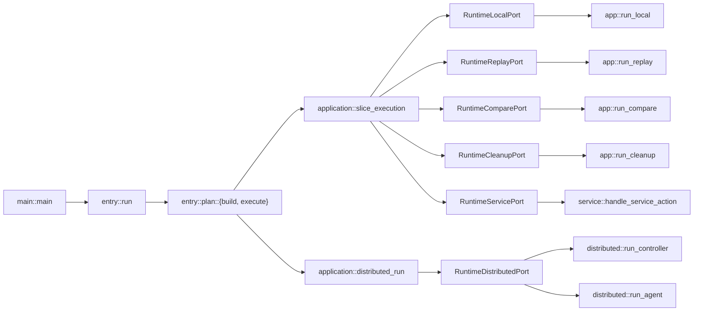
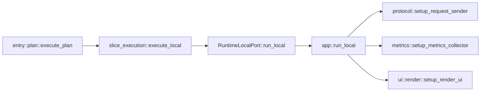
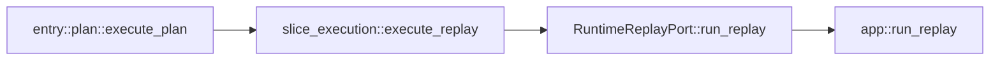
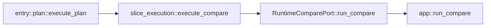
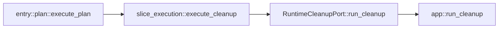
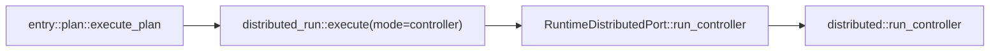
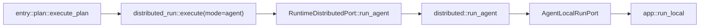

# Strest Architecture Overview

_Generated from `src/**/*.rs` on 2026-02-14 16:15:09 UTC_

_Purpose: direct call-flow view of the current architecture with explicit slice boundaries._

## Boundary Contract
1. `entry` calls `application` only.
2. `application` orchestrates use-cases and calls ports only.
3. `adapters::runtime` implements those ports and calls concrete runtime slices.
4. Runtime slices (`app`, `distributed`, `service`) do not call each other directly.
5. Boundary checks are enforced by `scripts/check_architecture.sh`.

## No-Spiderweb View (Current)

## Flow By Mode

### Local Run
Call chain:
`main -> entry::run -> entry::plan::execute_plan -> application::slice_execution::execute_local -> adapters::runtime::RuntimeLocalPort::run_local -> app::run_local`

### Replay
Call chain:
`main -> entry -> slice_execution::execute_replay -> RuntimeReplayPort::run_replay -> app::run_replay`

### Compare
Call chain:
`main -> entry -> slice_execution::execute_compare -> RuntimeComparePort::run_compare -> app::run_compare`

### Cleanup
Call chain:
`main -> entry -> slice_execution::execute_cleanup -> RuntimeCleanupPort::run_cleanup -> app::run_cleanup`

### Distributed Controller
Call chain:
`main -> entry -> distributed_run::execute(controller) -> RuntimeDistributedPort::run_controller -> distributed::run_controller`

### Distributed Agent
Call chain:
`main -> entry -> distributed_run::execute(agent) -> RuntimeDistributedPort::run_agent -> distributed::run_agent -> AgentLocalRunPort -> app::run_local`

## Enforced Boundary Checks
Current `scripts/check_architecture.sh` guardrails include:
- `src/application` cannot import `crate::app` or `crate::distributed`.
- `src/distributed` cannot import `crate::app` or `crate::application`.
- `src/entry` cannot import `crate::app`, `crate::distributed`, or `crate::service`.

Latest local run on 2026-02-14 passed these checks.
