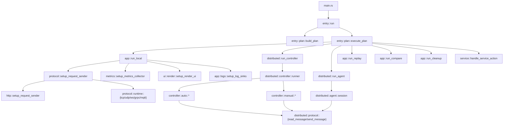
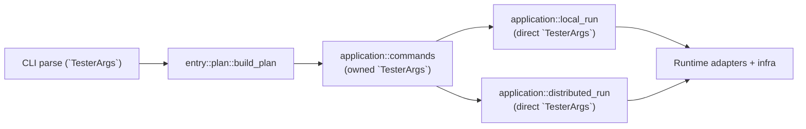
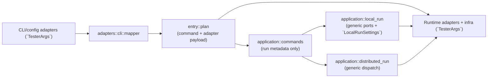
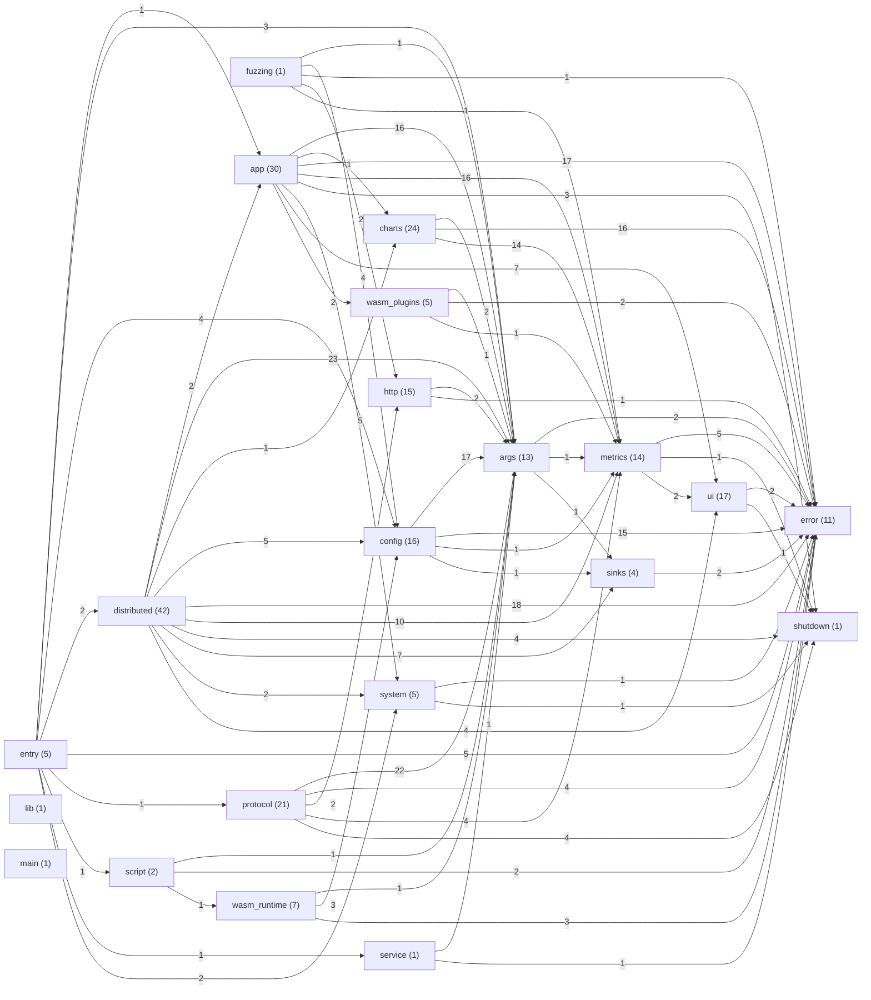

# Strest Architecture Overview

_Generated from `src/**/*.rs` on 2026-02-13 13:05:45 UTC_

_Phase 7 migration annotations updated on 2026-02-14._

## Scope
- Module inventory includes all source modules under `src/` (including test modules inside `src`).
- Dependency graph edges are derived from `crate::...` references in non-test source files only.
- Feature-gated modules: `wasm_plugins`, `wasm_runtime`, `fuzzing`, and legacy chart implementations.

## Runtime Flow


## Hexagonal Migration Snapshot (Phase 7)

### Before (Legacy Coupling Path)


### After (Phase 7 Boundary)


## Top-Level Dependency Graph


## Complete Module Hierarchy


## Module Inventory
### `app` (30)
```text
app
app::cleanup
app::compare
app::compare::compare_output
app::export
app::logs
app::logs::merge
app::logs::parsing
app::logs::records
app::logs::setup
app::logs::streaming
app::progress
app::replay
app::replay::bounds
app::replay::records
app::replay::runner
app::replay::snapshots
app::replay::state
app::replay::summary
app::replay::tests
app::replay::ui
app::runner
app::runner::alloc
app::runner::core
app::runner::core::finalize
app::runner::rss
app::runtime_errors
app::summary
app::summary::lines
app::summary::percentiles
```
### `args` (13)
```text
args
args::cli
args::cli::presets
args::cli::tester
args::defaults
args::parsers
args::tests
args::tests::defaults
args::tests::headers
args::tests::options_core
args::tests::options_extra
args::tests::subcommands
args::types
```
### `charts` (24)
```text
charts
charts::aggregated
charts::aggregated::buckets
charts::aggregated::latency
charts::aggregated::rps
charts::aggregated::util
charts::average
charts::cumulative
charts::driver
charts::driver::naming
charts::driver::plotting
charts::errors
charts::inflight
charts::latency
charts::rps
charts::status
charts::streaming
charts::streaming::basic
charts::streaming::basic::buckets
charts::streaming::basic::counts
charts::streaming::breakdown
charts::streaming::latency
charts::tests
charts::timeouts
```
### `config` (16)
```text
config
config::apply
config::apply::distributed
config::apply::load
config::apply::scenario
config::apply::section_basic
config::apply::section_runtime
config::apply::section_runtime::section_runtime_network
config::apply::section_runtime::section_runtime_output
config::apply::section_tail
config::apply::util
config::loader
config::parse
config::test_support
config::tests
config::types
```
### `distributed` (42)
```text
distributed
distributed::agent
distributed::agent::command
distributed::agent::run_exec
distributed::agent::session
distributed::agent::wire
distributed::controller
distributed::controller::agent
distributed::controller::auto
distributed::controller::auto::events
distributed::controller::auto::finalize
distributed::controller::auto::setup
distributed::controller::control
distributed::controller::http
distributed::controller::load
distributed::controller::manual
distributed::controller::manual::connections
distributed::controller::manual::control_http
distributed::controller::manual::loop_handlers
distributed::controller::manual::loop_idle
distributed::controller::manual::orchestrator
distributed::controller::manual::run_finalize
distributed::controller::manual::run_lifecycle
distributed::controller::manual::state
distributed::controller::runner
distributed::controller::shared
distributed::controller::shared::aggregation
distributed::controller::shared::events
distributed::controller::shared::timing
distributed::controller::shared::ui
distributed::controller::tests
distributed::controller::tests::aggregation
distributed::controller::tests::ui
distributed::protocol
distributed::protocol::io
distributed::protocol::types
distributed::summary
distributed::tests
distributed::tests::sink_runs
distributed::tests::wire_args
distributed::utils
distributed::wire
```
### `entry` (5)
```text
entry
entry::plan
entry::plan::build
entry::plan::execute
entry::plan::types
```
### `error` (11)
```text
error
error::app
error::config
error::distributed
error::http
error::metrics
error::script
error::service
error::sink
error::test_support
error::validation
```
### `fuzzing` (1)
```text
fuzzing
```
### `http` (15)
```text
http
http::rate
http::sender
http::sender::config
http::sender::worker
http::tests
http::tls
http::workload
http::workload::builders
http::workload::builders_auth
http::workload::data
http::workload::execution
http::workload::runner
http::workload::runner_common
http::workload::template
```
### `lib` (1)
```text
lib
```
### `main` (1)
```text
main
```
### `metrics` (14)
```text
metrics
metrics::collector
metrics::collector::helpers
metrics::collector::helpers::processing
metrics::collector::helpers::summary
metrics::collector::helpers::windows
metrics::collector::state
metrics::histogram
metrics::logging
metrics::logging::reader
metrics::logging::writer
metrics::logging::writer::db
metrics::tests
metrics::types
```
### `protocol` (21)
```text
protocol
protocol::builtins
protocol::examples
protocol::examples::chat_websocket
protocol::examples::game_udp
protocol::examples::telemetry_mqtt
protocol::registry
protocol::runtime
protocol::runtime::datagram
protocol::runtime::grpc
protocol::runtime::mqtt
protocol::runtime::resolve
protocol::runtime::spawner
protocol::runtime::tests
protocol::runtime::tests::datagram_mqtt
protocol::runtime::tests::scheme_resolution
protocol::runtime::tests::transport_http_grpc
protocol::runtime::transports
protocol::runtime::types
protocol::tests
protocol::traits
```
### `script` (2)
```text
script
script::loader
```
### `service` (1)
```text
service
```
### `shutdown` (1)
```text
shutdown
```
### `sinks` (4)
```text
sinks
sinks::config
sinks::format
sinks::writers
```
### `system` (5)
```text
system
system::banner
system::logger
system::probestack
system::shutdown_handlers
```
### `ui` (17)
```text
ui
ui::model
ui::render
ui::render::charts
ui::render::charts_status_data
ui::render::charts_window
ui::render::dashboard
ui::render::formatting
ui::render::frame
ui::render::lifecycle
ui::render::progress
ui::render::summary
ui::render::summary_panels_metrics
ui::render::summary_panels_quality
ui::render::summary_run
ui::render::theme
ui::tests
```
### `wasm_plugins` (5)
```text
wasm_plugins
wasm_plugins::constants
wasm_plugins::host
wasm_plugins::tests
wasm_plugins::validate
```
### `wasm_runtime` (7)
```text
wasm_runtime
wasm_runtime::constants
wasm_runtime::loader
wasm_runtime::module
wasm_runtime::parse
wasm_runtime::tests
wasm_runtime::validate
```
