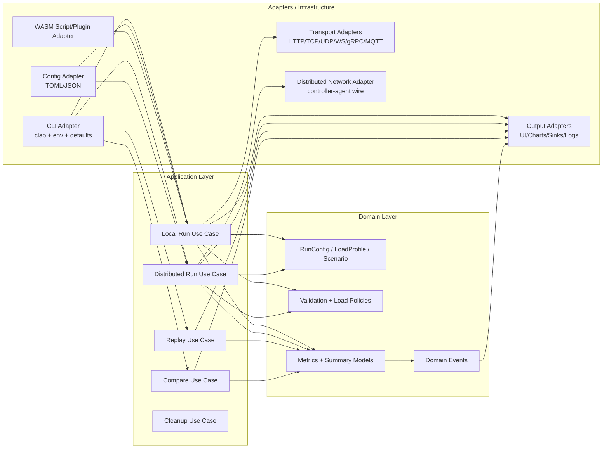

# Architecture Risks and Hexagonal Migration Plan

## Executive Summary
The codebase is a functional modular monolith, but business logic is strongly coupled to infrastructure, especially the CLI argument model (`TesterArgs`) and runtime IO concerns.

Current coupling profile (non-test files):
- `211` non-test Rust files.
- `71` files reference `crate::args`.
- `62` files directly use `TesterArgs`.
- Heaviest top-level dependencies: `distributed -> args (23)`, `protocol -> args (22)`, `config -> args (17)`, `app -> args (16)`.

This creates high friction for architectural goals: vertical slices, hexagonal boundaries, and clean separation between infra (CLI/parsing) and domain (business behavior).

## Findings (Prioritized)

### R1. CLI model (`TesterArgs`) is the de facto domain model
Severity: Critical

Evidence:
- `TesterArgs` is a clap-bound struct with parser metadata in `src/args/cli/tester.rs:18` and `src/args/cli/tester.rs:24`.
- Core runtime depends directly on it:
  - `src/app/runner/core/mod.rs:36`
  - `src/protocol/runtime.rs:35`
  - `src/metrics/collector/mod.rs:28`
  - `src/distributed/controller/auto/setup.rs:30`
  - `src/distributed/controller/manual/run_lifecycle.rs:21`

Impact:
- Domain and use-case code cannot evolve independently from CLI schema.
- Any CLI option growth increases transitive complexity across runtime modules.

Recommendation:
- Introduce domain command types (`RunLocalCommand`, `RunDistributedCommand`, `ReplayCommand`, etc.) and map `TesterArgs -> Command` only in an adapter layer.

### R2. Domain types live in `args` (interface layer)
Severity: Critical

Evidence:
- Core concepts (`Protocol`, `LoadMode`, `Scenario`, `ScenarioStep`) are defined in `src/args/types.rs:101`, `src/args/types.rs:136`, `src/args/types.rs:299`, `src/args/types.rs:307`.
- Same module also carries CLI-oriented derives and parsing coupling (e.g., `ValueEnum`) in `src/args/types.rs:9`, `src/args/types.rs:101`.

Impact:
- Domain policy objects are anchored to interface concerns.
- Prevents clean reuse for non-CLI entry points (service API, controller API, future SDK).

Recommendation:
- Move business enums/models to `domain` and keep CLI serialization/parsing wrappers in `adapters::cli`.

### R3. Config pipeline mutates CLI struct directly
Severity: High

Evidence:
- `apply_config(args: &mut TesterArgs, ...)` in `src/config/apply.rs:21`.
- Scenario parsing uses runtime defaults from CLI args in `src/config/apply/scenario.rs:6` and `src/config/apply/scenario.rs:19`.

Impact:
- Configuration behavior is tied to CLI precedence mechanics.
- Hard to reason about “effective runtime config” outside CLI execution.

Recommendation:
- Parse config into domain settings/overrides object, then merge in application layer with explicit precedence policy.

### R4. Use-case orchestration mixes domain flow with adapters
Severity: High

Evidence:
- Local run orchestration in `src/app/runner/core/mod.rs` handles:
  - plugins `src/app/runner/core/mod.rs:42`
  - shutdown channels `src/app/runner/core/mod.rs:53`
  - UI setup `src/app/runner/core/mod.rs:128`
  - protocol sender creation `src/app/runner/core/mod.rs:112`
  - metrics collector setup `src/app/runner/core/mod.rs:138`
- Distributed setup/finalization also mixes concerns:
  - UI setup in `src/distributed/controller/auto/setup.rs:189`
  - chart/sink writing in `src/distributed/controller/auto/finalize.rs:86` and `src/distributed/controller/auto/finalize.rs:104`

Impact:
- Hard to test core policies without tokio/UI/network dependencies.
- Changes to output or transport behavior risk regressions in run control logic.

Recommendation:
- Move orchestration into application services that depend on ports (`UiPort`, `SinkPort`, `TrafficPort`, `MetricsPort`, `ShutdownPort`).

### R5. Protocol runtime selection is centralized and infra-coupled
Severity: High

Evidence:
- Big `match` on protocol in `src/protocol/runtime.rs:41` with direct calls into HTTP and transport code.
- Depends on `TesterArgs` throughout `src/protocol/runtime.rs:35`.

Impact:
- Adding protocol behavior touches central switch and request setup flow.
- Protocol execution cannot be swapped/tested cleanly as adapters.

Recommendation:
- Introduce `TransportAdapter` port registry keyed by domain `ProtocolKind`; application asks registry to build sender from domain command.

### R6. Distributed slice leaks presentation/output concerns
Severity: Medium-High

Evidence:
- Distributed shared aggregation imports charts and sinks: `src/distributed/controller/shared/aggregation.rs:4` and `src/distributed/controller/shared/aggregation.rs:8`.
- Distributed UI updates build `UiData` directly: `src/distributed/controller/shared/ui.rs:13`.

Impact:
- Distributed domain decisions depend on specific output technologies.
- Hard to run headless controller service with alternative observers.

Recommendation:
- Keep distributed slice focused on coordination/state; publish domain events and push rendering/sinks to adapters.

### R7. Entry planning carries full CLI struct across all run modes
Severity: Medium

Evidence:
- `RunPlan` variants still carry `TesterArgs` in `src/entry/plan/types.rs:31`, `src/entry/plan/types.rs:33`, `src/entry/plan/types.rs:35`, `src/entry/plan/types.rs:38`.

Impact:
- Every mode receives oversized, weakly-typed option bags.
- Mode-specific invariants are enforced late and scattered.

Recommendation:
- Build strongly typed mode commands early in planning; keep `RunPlan` payloads mode-specific and minimal.

## Misalignment Patterns

### P1. Horizontal modules, vertical behavior
Behavior is vertical (local run, distributed run, replay, compare), but code organization is mostly horizontal by technical layer (`http`, `metrics`, `ui`, `config`), causing broad coupling.

### P2. Mutable mega-config object anti-pattern
`TesterArgs` acts as mutable global state passing through multiple subsystems; modules both read and rewrite it.

### P3. Adapter logic embedded inside application flow
UI, sink, chart, signal, plugin wiring appears in core run functions rather than at composition boundaries.

### P4. Implicit precedence rules
Config/CLI merge semantics are encoded as mutation order instead of explicit, versioned policy objects.

## Existing Seams to Leverage

1. `distributed::wire` already transforms to a transport DTO (`WireArgs`) in `src/distributed/wire.rs:10`.
2. Protocol registry abstraction exists in `src/protocol/traits.rs` and `src/protocol/registry.rs`.
3. Entry plan already models run modes (`RunPlan`) in `src/entry/plan/types.rs:28`.

These are useful anchors for incremental migration without a rewrite.

## Target Architecture (Vertical Slices + Hexagonal)

## Proposed Vertical Slices

1. `local_run` slice
- Domain: run config, load policies, runtime invariants.
- Application: run lifecycle orchestration.
- Adapters: protocol sender, metrics stream, ui/sink/charts output.

2. `distributed_run` slice
- Domain: agent/session/run state, aggregation rules.
- Application: controller/agent workflows.
- Adapters: TCP wire protocol, controller API, distributed output adapters.

3. `replay_compare` slice
- Domain: replay windows, comparison math.
- Application: replay and compare use cases.
- Adapters: terminal UI and file IO.

4. `shared_kernel` (minimal)
- Strongly shared value objects only: protocol kind, load mode, durations, errors.

## Ports and Adapters Blueprint

### Core ports (application-facing)
- `RunTrafficPort`: start/stop traffic, stream request outcomes.
- `MetricsPort`: aggregate outcomes, emit snapshots.
- `OutputPort`: summaries/events/charts/sinks/UI updates.
- `ScriptPort`: scenario/script loading hooks.
- `ClusterPort`: agent registration/config/start/stop/report.
- `ClockPort` and `ShutdownPort`: deterministic time/cancel control.

### Adapter implementations (initial)
- CLI adapter: `TesterArgs` parsing + mapping.
- Config adapter: file loaders/parsers to `ConfigOverrides`.
- Transport adapters: existing `http` + protocol runtime senders.
- Output adapters: existing UI/charts/sinks/logs.
- Cluster adapter: existing distributed protocol IO.

## Migration Plan (Incremental, No Big-Bang)

### Phase 0: Architecture guardrails (1 week)
1. Add architecture ADR in `docs/` defining layers and dependency rules.
2. Add CI script enforcing forbidden imports:
- domain cannot import `clap`, `reqwest`, `tokio`, `ratatui`, `crossterm`.
- application cannot import `clap` directly.
3. Track baseline coupling metrics (`TesterArgs` references, cross-module edges).

Exit criteria:
- Guardrails merged and enforced in CI.

Phase 0 artifacts (implemented):
- ADR: `docs/architecture/adr/ADR-0001-hexagonal-vertical-slices.md`
- Guardrail script: `scripts/check_architecture.sh`
- Coupling baseline snapshot: `docs/architecture/ard/ARCHITECTURE_BASELINE_METRICS.md`
- CI enforcement: `.github/workflows/pr.yml` and `.github/workflows/release.yml`

### Phase 1: Introduce domain commands + anti-corruption mapping (1-2 weeks)
1. Create `domain::run` types (`RunConfig`, `ProtocolKind`, `LoadMode`, `Scenario`).
2. Create `application::commands` per mode.
3. Implement `adapters::cli::mapper` from `TesterArgs` to commands.
4. Keep legacy APIs; use mapping in entry.

Exit criteria:
- `entry` calls use-case commands, not raw `TesterArgs` (except adapter boundary).

Phase 1 artifacts (implemented):
- Domain run model: `src/domain/run.rs`
- Application commands per mode: `src/application/commands.rs`
- CLI anti-corruption mapper: `src/adapters/cli/mapper.rs`
- Entry plan command wiring: `src/entry/plan/types.rs`, `src/entry/plan/build.rs`, `src/entry/plan/execute.rs`

### Phase 2: Config decoupling (1-2 weeks)
1. Replace `config::apply_config(&mut TesterArgs, ...)` with `ConfigOverrides` builder.
2. Merge order defined in one place: `CLI > Config > Preset defaults`.
3. Scenario parsing consumes domain defaults, not `TesterArgs`.

Exit criteria:
- Config module no longer depends on `TesterArgs` mutability.

Phase 2 artifacts (implemented):
- Config override merge path: `src/config/apply.rs`
- Scenario defaults parsing seam: `src/config/apply/scenario.rs`
- Entry wiring for effective args + scenario registry: `src/entry/plan/build.rs`

### Phase 3: Local run use case extraction (2 weeks)
1. Extract `run_local` to `application::local_run::execute(command, ports)`.
2. Introduce ports for traffic, metrics, outputs, shutdown.
3. Implement adapters by wrapping existing modules.

Exit criteria:
- `src/app/runner/core/mod.rs` reduced to adapter composition.

Phase 3 artifacts (implemented):
- Local run use-case orchestration with ports: `src/application/local_run.rs`
- Local run adapter composition layer: `src/app/runner/core/mod.rs`

### Phase 4: Protocol adapter boundary (1-2 weeks)
1. Refactor protocol switch to registry-based `TransportAdapter` implementations.
2. Move protocol setup to adapter layer.
3. Keep `ProtocolRegistry` but drive it from domain `ProtocolKind`.

Exit criteria:
- Application no longer depends on `protocol/runtime` internals.

Phase 4 artifacts (implemented):
- Transport adapter boundary contract: `src/protocol/traits.rs`
- Registry-driven builtin transport adapter wiring: `src/protocol/builtins.rs`, `src/protocol/registry.rs`, `src/protocol/runtime.rs`
- Domain protocol key flow in planning/local-run adapter seams: `src/entry/plan/build.rs`, `src/application/local_run.rs`, `src/app/runner/core/mod.rs`

### Phase 5: Distributed slice extraction (2-3 weeks)
1. Introduce `DistributedRunCommand` and domain state models.
2. Move controller/agent workflows into application services.
3. Replace direct UI/sink/chart calls with output events and output adapters.

Exit criteria:
- distributed application flow has no direct UI/charts/sinks imports.

Phase 5 artifacts (implemented):
- Distributed run command + application execution port: `src/application/commands.rs`, `src/application/distributed_run.rs`, `src/entry/plan/types.rs`, `src/entry/plan/build.rs`, `src/entry/plan/execute.rs`
- Controller output adapter/event boundary for auto/manual flows: `src/distributed/controller/output.rs`, `src/distributed/controller/auto/setup.rs`, `src/distributed/controller/auto/events.rs`, `src/distributed/controller/auto/finalize.rs`, `src/distributed/controller/manual/run_lifecycle.rs`, `src/distributed/controller/manual/loop_handlers.rs`, `src/distributed/controller/manual/run_finalize.rs`, `src/distributed/controller/manual/state.rs`
- Shared aggregation narrowed to state aggregation primitives: `src/distributed/controller/shared/aggregation.rs`, `src/distributed/controller/shared/events.rs`

### Phase 6: Replay/compare slice extraction (1-2 weeks)
1. Split replay/compare use cases from terminal event loop logic.
2. Keep key event handling and rendering in adapters.

Exit criteria:
- replay/compare core logic testable without terminal runtime.

### Phase 7: Remove legacy coupling and enforce strict boundaries (1 week)
1. Deprecate direct `TesterArgs` use outside CLI adapter.
2. Remove now-obsolete conversion glue.
3. Raise CI checks from warning to fail-on-violation.

Exit criteria:
- `TesterArgs` references constrained to CLI/config adapter composition layer.

## Recommended First Backlog (Concrete)

1. Create `src/domain/run.rs` and move `Protocol`, `LoadMode`, `Scenario`, `ScenarioStep` there.
2. Create `src/adapters/cli/mapper.rs` with `fn to_run_command(args: TesterArgs) -> AppResult<RunCommand>`.
3. Create `src/application/local_run.rs` with `RunLocalCommand` and `execute` signature.
4. Update `src/entry/plan/types.rs` to hold typed commands instead of raw `TesterArgs` where possible.
5. Add `scripts/check_architecture.sh` and CI job with import-boundary assertions.

## Success Metrics

Track these per PR/sprint:
- Count of non-test files referencing `TesterArgs` (baseline: `62`, target first milestone: `<35`, final target: `<10` and only adapters/bootstrap).
- Count of non-test files referencing `crate::args` (baseline: `71`, target first milestone: `<40`, final target: adapter-only).
- Number of use cases executable with mocked ports and no terminal/network dependencies.
- Time-to-add-new-protocol/new-output-sink (should fall as adapters isolate infra concerns).

## Risks During Migration

1. Behavior drift from precedence changes (`CLI vs config`) during mapping extraction.
Mitigation: golden tests from current CLI fixtures before refactor.

2. Increased temporary complexity (old and new pathways coexisting).
Mitigation: feature flags / branch-by-abstraction and strict deprecation checkpoints.

3. Performance regressions from extra abstraction.
Mitigation: keep hot paths in adapters concrete; use trait objects at composition boundaries only.

4. Team adoption inconsistency.
Mitigation: ADR + CI guardrails + PR template checks for boundary violations.
